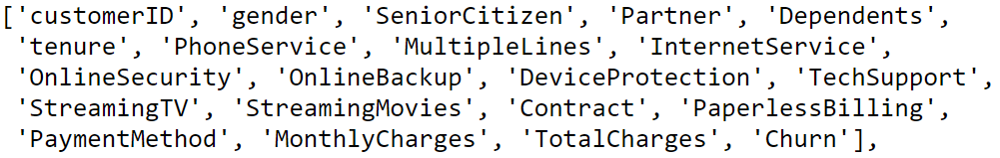
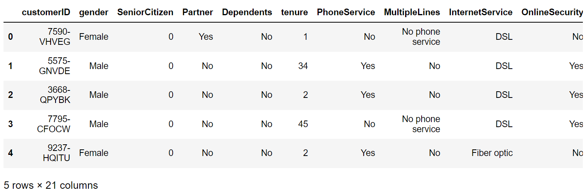

<!-- PROJECT TITLE -->
**<h1 align="center">Customer Churn Prediction</h1>**

<!-- LOGO -->
<p align="center">
  
</p>

<!-- PROJECT DESCRIPTION -->
## <br>**➲ Project description**
Customer churn is the percentage of customers that stopped using your company's product
or service during a certain time frame, We will use machine learning algorithm called logistic regression to predict this value by train the model in dataset of customers information with their churn value and then predict future churn value for future customers.

<!-- PREREQUISTIES -->
## <br>**➲ Prerequisites**
This is a list of required packages for the project to be installed :
* <a href="https://www.python.org/downloads/" target="_blank">Python 3.x</a>
* Pandas 
* Numpy
* Seaborn
* Matplotlib
* Scikit-learn

Install all required packages :
 ```sh
  pip install -r requirements.txt
  ```

<!-- THE DATASET -->
## <br>**➲ The Dataset**
The customer churn dataset contain 20 feature to describe customer state<br>
and a target column **"Churn"** which decide if the customer stay or not.<br>
<br>**Dataset features and target :**
<br>
<br>**Dataset head :**


<!-- CODING SECTIONS -->
## <br>**➲ Coding Sections**
In this part we will see the project code divided to sections as follows:
<br>

- Section 1 | Data Preprocessing :<br>
In this section we aim to do some operations on the dataset before training the model on it,
<br>processes like loading dataset, check missing values and dataset statistics.
<br>then we visualize some dataset columns in order to have some insights for better understanding, remove unnecessary columns and convert all the non-numeric columns to numeric.
<br>Finally we scale the dataset and split it into training and testing sets<br>

- Section 2 | Model Creation :<br>
The dataset is ready for training, so we create a logistic regression model using scikit-learn and thin fit it to the data.<br>

- Section 3 | Model Evaluation :<br>
Finally we evaluate the model by getting accuracy, classification report and confusion matrix.

<!-- INSTALLATION -->
## <br>**➲ Installation**
1. Clone the repo
   ```sh
   git clone https://github.com/omaarelsherif/Customer-Chrun-Prediction-Using-Machine-Learning.git
   ```
2. Run the code from cmd
   ```sh
   python customer_churn.py

<!-- OUTPUT -->
## <br>**➲ Output**
Now let's see the project output after running :

**Dataset head :**<br>
<br><br>

**Missing values :**<br>
<br><br>

**Dataset description :**<br>
<br><br>

**Count of customer churn :**<br>
<br><br>

**Count of customer churn based on gender :**<br>
<br><br>

**Count of customer churn based on internet services :**<br>
<br><br>

**Customer tenure and monthly charges :**<br>
<br><br>

**Model confusion matrix :**<br>
<br><br>

**Model accuracy and classification report :**<br>
<br><br>

<!-- REFERENCES -->
## <br>**➲ References**
These links may help you to better understanding of the project idea and techniques used :
1. Customer chrum in machine learning : https://bit.ly/3B7zOte
2. Logistic regression : https://bit.ly/3kqIIeA
3. Model evaluation : https://bit.ly/3B12VOO

<!-- CONTACT -->
## <br>**➲ Contact**
- E-mail   : [omaarelsherif@gmail.com](mailto:omaarelsherif@gmail.com)
- LinkedIn : https://www.linkedin.com/in/omaarelsherif
- Facebook : https://www.facebook.com/omaarelshereif
